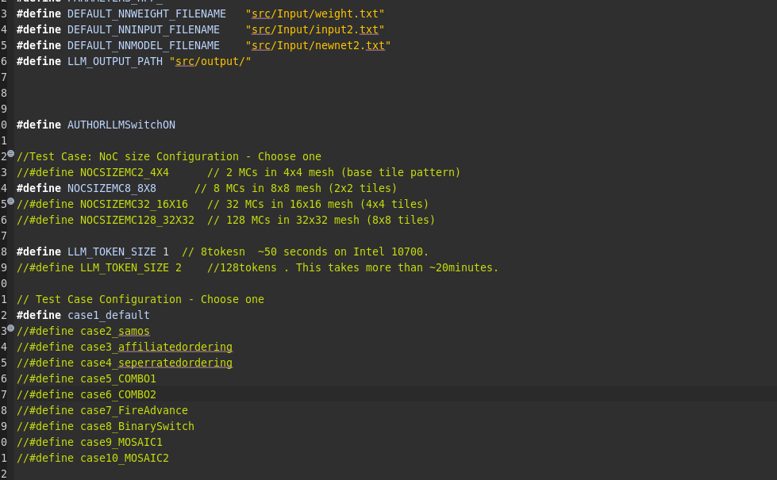

 # Anonymous Repository for Double-Blind Review

  > **Note**: This anonymous repository will be ready before Nov. 24 (authors need to remove personal information for double-blind review).
  > If accepted, the codes will be open-source for the public.
  > README may be continuously updated to serve as a tutorial.

  ---

  ## Development Environment

  This work was developed with the **Eclipse IDE**.

  ---

  ## Configuration Guide

  

  To run different configurations, comment/uncomment the settings in `parameters.hpp`, then build and run.

  ### Example Configuration

  ```cpp
  #define AUTHORLLMSwitchON

  #define NOCSIZEMC8_8X8
  #define LLM_TOKEN_SIZE 1
  #define case1_default

  This runs an attention matrix in an 8×8 NoC with 8-token (sentence-level) using the baseline configuration.
  ```cpp
  ```cpp
  ---
  Configuration Options

  1. Workload Selection

  Choose between attention matrix or LeNet:

  #define AUTHORLLMSwitchON   // Enable LLM attention workload
  //#define AUTHORLLMSwitchON  // Disable for LeNet workload

  2. NoC Size Options

  Select the mesh size and memory controller configuration:

  //#define NOCSIZEMC2_4X4      //   4×4 mesh  
  #define NOCSIZEMC8_8X8       //   8×8 mesh  
  //#define NOCSIZEMC32_16X16   //  16×16 mesh 
  //#define NOCSIZEMC128_32X32  //   32×32 mesh

  3. Token Length Options

  Note: Only applicable when #define AUTHORLLMSwitchON is enabled.

  #define LLM_TOKEN_SIZE 1     // 8 tokens (~50 seconds on Intel 10700)
  //#define LLM_TOKEN_SIZE 2    // 128 tokens (~20+ minutes)

  4. Optimization Configurations

  Select the optimization strategy:

  #define case1_default                    // Baseline
  //#define case2_samos                    // SAMOS Travel Time mapping
  //#define case3_affiliatedordering       // Affiliated Ordering
  //#define case4_seperratedordering       // Separated Ordering
  //#define case5_COMBO1                   // Combo-1
  //#define case6_COMBO2                   // Combo-2
  //#define case7_FireAdvance              // Fire Advance
  //#define case8_BinarySwitch             // Binary Switch
  //#define case9_MOSAIC1                  // MOSAIC-1
  //#define case10_MOSAIC2                 // MOSAIC-2

  ---
